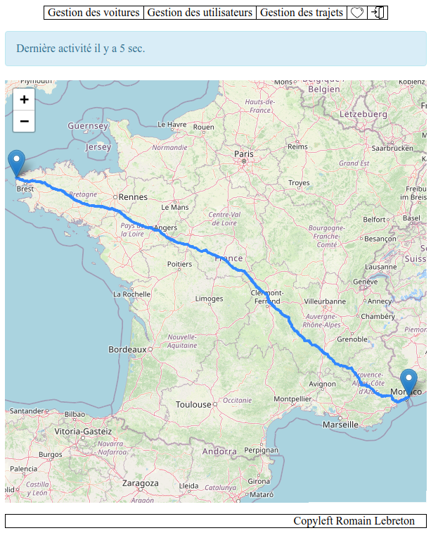

<section>
## Sujet 

Une application Web codée qui calcule l'itinéraire le plus court entre 2 communes

</section>

<section>
## Votre mission

À partir d'un code existant, vous devrez évaluer puis optimiser : 
* les performances (temps, mémoire, ...)
* la qualité logicielle (tests, organisation, commentaires, ...)
* l'ergonomie (JS, rajouter des fonctionnalités, ...)
* la sécurité (faille de sécurité ?)
* bilan écologique (de l'appli Web, du gain pour un conducteur)
</section>

<section>
## Organisation

* Dépôt Git avec le code de base existant (en PHP)
* Base de donnée existante (PostgreSQL)
* Vos contacts principaux : 
  * Q1 : Romain Lebreton
  * Q2 : Malo Gasquet
  * Q5 : Cyrille Nadal
* groupes de 4 : à négocier entre vous, et le délégué nous contacte (Malo, Cyrille & moi) pour qu'on valide/tranche
  → nous donner rapidement les groupes et l'adresse du repo Git avec tous les droits, un journal de bord, ...

**Livrables :**
* Journal de bord (pour qu'on puisse vous suivre plus facilement)
* Compte-rendu sur les optimisations réalisées (conception, code, jeux d'essais…)
* Rapport final 

*"Journal de bord" + réunion toutes les 2 semaines pour les cadrer. Ils doivent nous expliquer quelles parties ils optimisent, pourquoi et comment.*

</section>
<section>
## Planning provisoire

* Semestre 4 : 9 semaines de cours, 1 semaine vacances
* Sprint de 2 semaines  
  → points intermédiaires les semaines du 20/02, 13/03, 27/03  
  → soutenance la semaine du 10/04
* Séance du 20 février : 
  * qu'avez-vous évalué ? Pourquoi ?
  * qu'avez-vous choisi d'amélioré ? Pourquoi ? Comment ?
  * Aide technique pour faire marcher les outils à l'IUT ou sur votre machine :  
    xDebug, PHPUnit, PostgreSQL (installation + liaison PHP), ...
* À venir :   
  * Séance impact environnemental 
  * Séance test en PHP avec PHPUnit
</section>

<section>
# Code existant

[Démo](http://localhost/~lebreton/PHP2223/SAE4/CodeBaseEtudiants/web/controleurFrontal.php?action=plusCourtChemin&controleur=noeudCommune)

~15 secondes pour parcourir 300 mètres...

</section>

<section>
## Données

* Réseau routier français [Route500](https://geoservices.ign.fr/route500) fourni par l'IGN
* 35&#8201;000 communes, 1&#8201;300&#8201;000 tronçons de route qui s'intersectent en 900&#8201;000 nœuds routiers (carrefours)
* L'IGN fournit une [documentation](https://geoservices.ign.fr/documentation/donnees/vecteur/route500) et un [descriptif de contenu](https://geoservices.ign.fr/sites/default/files/2021-12/DC_ROUTE500_3-0.pdf)
* J'ai converti pour vous les données du format [Shapefile](https://en.wikipedia.org/wiki/Shapefile) vers du SQL.
* Les données géométriques sont au format latitude / longitude ([EPSG:4326](https://epsg.io/4326)) utilisée par les GPS, OpenStreetMap, ...
{: .incremental}
</section>

<section>
## Base de données PostgreSQL

* Extension [PostGIS](https://postgis.net/docs/reference.html) pour manipuler des données géométriques
* Exemple de fonction PostGIS : 
  * [ST_DistanceSphere](https://postgis.net/docs/ST_DistanceSphere.html) calcule une distance en mètres
* Vous avez le privilège `SELECT` sur les tables `noeud_commune`, `noeud_routier` et `troncon_route` du schéma `rletud` à l'IUT
* Démo sous DBeaver (paramètres + visu spatiale)

Montrer les paramètres DBeaver et la visualisation 

</section>

<section>
# Mesurer
</section>

<section>
## Analyse de performances du PHP

* [Xdebug](https://xdebug.org/) permet d'analyser les performances du PHP, de lancer un débogueur, ...
* Xdebug est installé à l'IUT : 
  * Appelez votre page Web en remplaçant l'hôte `webinfo` par `162.38.222.150`
  * rajoutez `XDEBUG_TRIGGER` dans la *query string*
  * Inspectez les en-têtes de réponse pour connaître votre fichier d'analyse  
    `X-Xdebug-Profile-Filename: /home/xdebug/log/cachegrind.out.173610`
  * Allez sur l'URL http://162.38.222.150/xdebug (identifiants: xdebug/iut2023)
    pour récupérer le fichier `cachegrind`
  * ouvrez le fichier avec un analyseur, par ex. KCacheGrind
* [Démo](https://162.38.222.150/info.php?XDEBUG_TRIGGER) avec KCacheGrind

KcacheGrind :
* temps (10ns), mémoire
* Cumul et en propre
* Se balader dans le source
* Arbre des appels

</section>

<section>
## Planning provisoire cours de Web

Notions que vous pourrez intégrer au fur et à mesure

Développement Web (JS) : 
* Semaines 2 & 3 : 
  Objets et interaction avec la page Web
* Semaines 4 & 5 : 
  requêtes asynchrones AJAX
* Semaine 6 : 
  Suivi de projet

Complément Web : 
* Semaines 4, 5, 6 : compléments PHP  
  Bibliothèques PHP, API REST
* Semaines 7 (2 TDs) & 8 : compléments JS  
  Site Web en programmation réactive
</section>

<!-- <section>
</section>

<section>
</section> -->

<!-- 
! Lien git code de base !

Import BD, install postGIS
Install xdebug
Parcours code PHP
Démo solution
 -->
