<!-- 
Les GIF ou les animations CSS ne sont pas dans la partie "Render" de l'event loop
Il semble que des thread séparés "Rasterizer thread" (cf DevTools > Performance) parallélise cet aspect.
Source à lire : 
https://frarizzi.science/journal/web-engineering/browser-rendering-queue-in-depth
https://medium.com/@francesco_rizzi/javascript-main-thread-dissected-43c85fce7e23


 -->
<section>

## Plan du cours

<div style="font-size=120%">
*Asynchronisme* utilisé pour résoudre des problèmes de blocage.

**Plan :**

1. Chargement des pages Web

1. AJAX : requêtes HTTP (a)synchrones 
   1. Présentation, objectifs
   1. Requêtes avec `XMLHttpRequest`
   1. Échanges de données au format JSON
   1. Asynchrone pour résoudre des blocages
</div>

</section>
<section>

# Chargement des pages Web

</section>
<section>

<!--
http://stackoverflow.com/questions/436411/where-is-the-best-place-to-put-script-tags-in-html-markup
https://developers.google.com/speed/docs/insights/BlockingJS
async
defer
-->

## Chargement des pages Web

<!-- Reprendre le stack overflow
** Spécifique à Chrome - V8 ** ?
-->

1. Récupération de la page HTML
2. Lecture du document HTML au fur et à mesure
   1. Nœuds *balise*, *texte* :  
      rajoutée au DOM au fur et à mesure
   2. Feuille CSS externe :  
      chargement de la feuille et application de ses règles **en
      parallèle** du DOM (non bloquant)
   3. JavaScript :  
      chargement du fichier JS puis exécution  
      **Attention :** Bloque la construction du DOM et du CSS !
   4. Balises images, vidéos :  
      le fichier est chargé **en parallèle** (non bloquant)

<!-- 

Impossibilité d'interagir avec un document si JavaScript est occupé (bloquant)

lier explication avec l'affichage Network de Chrome Voir "load event" de Eloquent JavaScript

Seulement un bout de JS peut s'exécuter en même temps. Donc n'importe quel
script, gestionnaire d'évènement, rafraîchissement de la page ... peut bloquer
la page Et les gestionaires d'évènements (et le rafraichissement de la page)
doive attendre que le script courant ai fini !

https://developer.chrome.com/devtools/docs/network#resource-network-timing
DOMContentLoad event marker ... 

http://stackoverflow.com/questions/1795438/load-and-execution-sequence-of-a-web-page 
http://wprof.cs.washington.edu/tests/
https://developers.google.com/web/fundamentals/performance/critical-rendering-path/
http://calendar.perfplanet.com/2012/deciphering-the-critical-rendering-path/
-->

</section>
<section>

<!--
Record
Throttle
DOMContentLoaded & load event fired
https://developers.google.com/web/tools/chrome-devtools/profile/network-performance/resource-loading#resource-network-timing
-->

## Problèmes de chargement

<br>
<a href="{{site.baseurl}}/assets/DOMLoadingError.html">Erreur en cas d'interaction trop tôt</a>.

<br>
<br>

<a href="{{site.baseurl}}/assets/DOMLoading.html">Page montrant le chargement progressif</a>.

</section>
<section>

## Solutions (1/3)

<!--

Reprendre le transparent suivant :
async n'est peut-être pas trop utilisé
Super dessin sur le standard
https://html.spec.whatwg.org/multipage/scripting.html#script

Autre source
http://www.html5rocks.com/en/tutorials/speed/script-loading
http://www.growingwiththeweb.com/2014/02/async-vs-defer-attributes.html
-->

* Mettre la balise `<script>` à la fin : 
  * Avantage : Le DOM est prêt.
  * Inconvénient : Ne télécharge pas le script avant d'arriver à la fin du
    document. 

* Attendre la fin du chargement du `DOM` (événement `DOMContentLoaded`) avant de
  lancer le script :
  * Avantage : Le DOM est prêt. On peut mettre la balise `<script>` où l'on veut.
  * Inconvénient : Ne télécharge pas le script avant d'arriver à la fin du
    document. 

  **Rappel :** L'événement `DOMContentLoaded` est lancé quand le document a été
  chargé et analysé, sans attendre le chargement des CSS, images, ...
{:.incremental}

</section>
<section>

## Solutions (2/3)

* `<script src="..." async></script>` :  
  Le script est téléchargé en parallèle de la lecture du DOM (non bloquant) et
  exécuté dès qu'il est disponible. <!-- (ce qui met en pause le reste). -->
   
  **Attention :** Le DOM n'est pas forcément prêt. Les scripts ne sont pas
    forcément exécutés dans l'ordre où ils sont déclarés.
 	
  <!-- * Avantage : On peut mettre la balise `<script>` où l'on veut. -->
  <!-- * Inconvénient : Le DOM n'est pas forcément prêt. Les scripts ne sont pas -->
  <!--   forcément exécutés dans l'ordre où ils sont déclarés. -->
   
  <!--
  Du coup, on ne perd plus le temps de chargement
  
  On ne peut pas couper au fait que l'exécution du JS bloque le reste puisque le
  JS classique (synchrone) ne fait qu'un truc à la fois
  
  Attention, l'ordre d'exécution des scripts n'est plus garanti
  -->

* `<script src="..." defer></script>` :  
   Le script est chargé en parallèle de la lecture du DOM et ne sera exécuté
   qu'une fois le DOM prêt.
  * Avantage : Les scripts sont exécutés dans l'ordre.
  * Inconvénient : Comme ils sont exécutés dans l'ordre, un `<script>` ne peut s'exécuter qu'après le chargement des `<script>` précédents.
   
   **Note :** Seulement pour les scripts à télécharger (= avec attribut `src`).
{:.incremental}

<!--
Voir l'onglet *Network* pour une visualisation :
Décocher tout, afficher juste name & timeline, Throttling GPRS
Montrer DOMContentLoaded & load
On voit que DOMContentLoaded n'attend pas les images (ni le CSS??)
Contrairement à load (qui n'attend pas les fontes externes)

-->

</section>
<section>

## Solutions (3/3)


{:title="Chargement des scripts" .slide_image}

On vous conseille généralement de privilégier `defer`.

[Source](https://html.spec.whatwg.org/multipage/scripting.html#script){: .myfootnote}

</section>
<section>

# AJAX : <br> Requêtes HTTP (a)synchrones

</section>
<section>

##  Utilisation classique d’un serveur

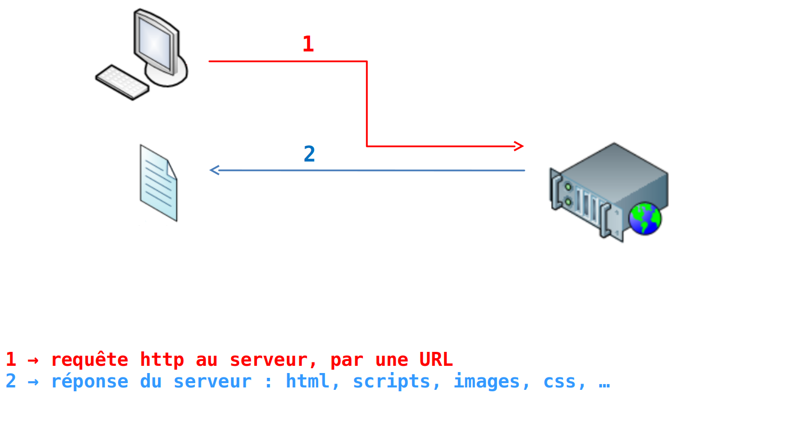{: .slide_image}

</section>
<section>

##  Utilisation classique d’un serveur

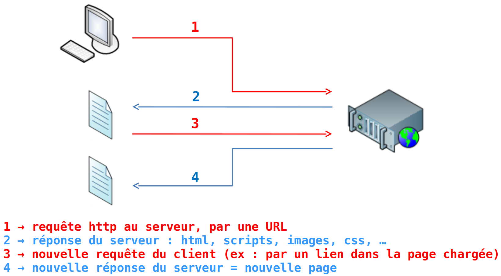{: .slide_image}

</section>
<section>

##  Utilisation classique d’un serveur

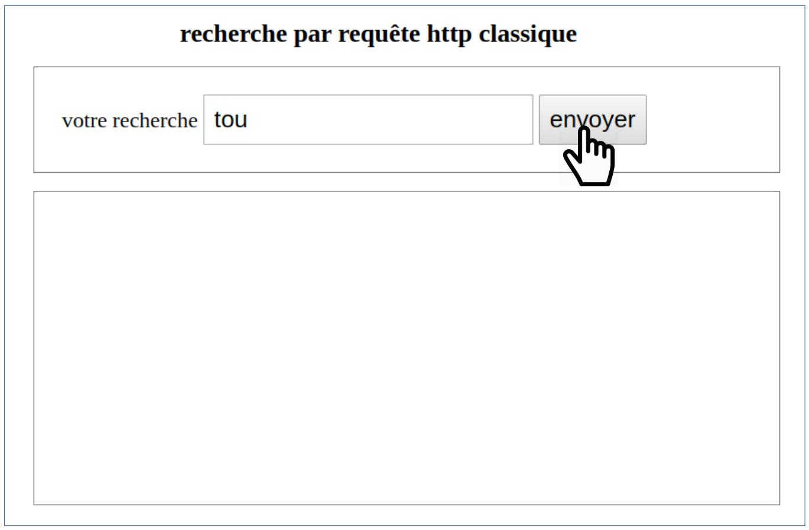{: .slide_image}
</section>
<section>

##  Utilisation classique d’un serveur

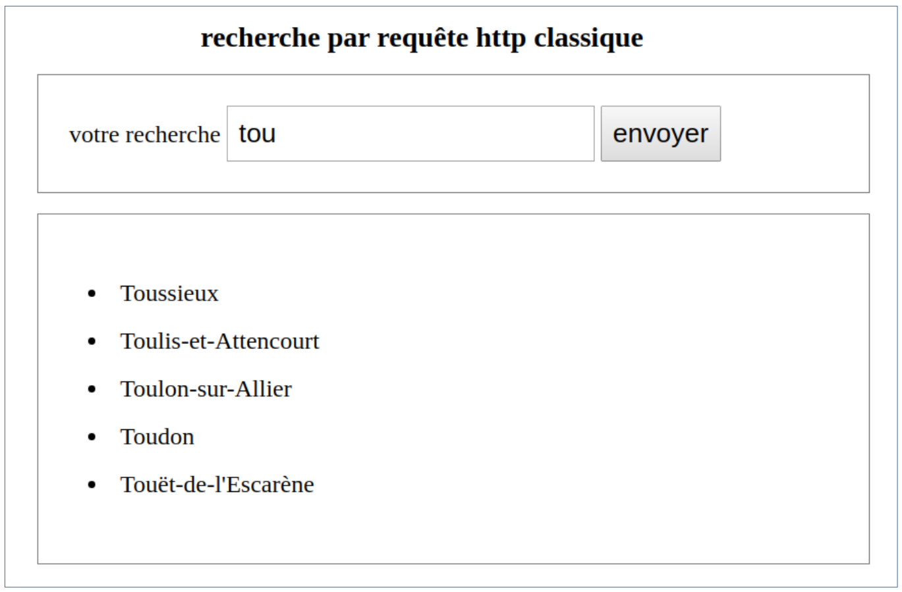{: .slide_image}
</section>
<section>

##  Utilisation plus dynamique

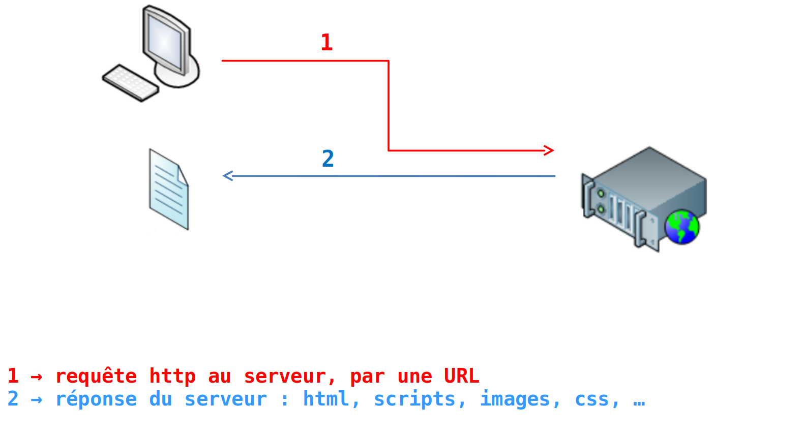{: .slide_image}

</section>
<section>

##  Utilisation plus dynamique

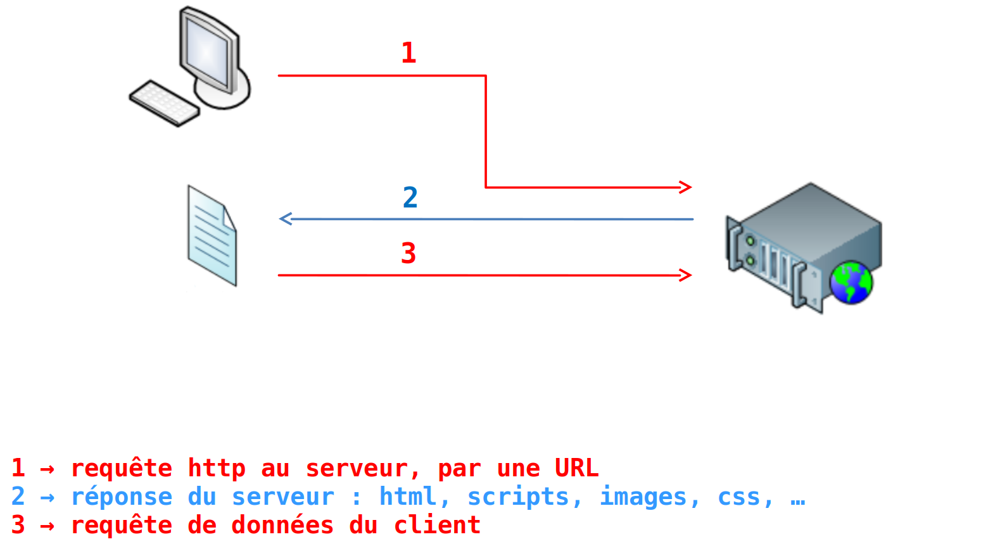{: .slide_image}

</section>
<section>

##  Utilisation plus dynamique

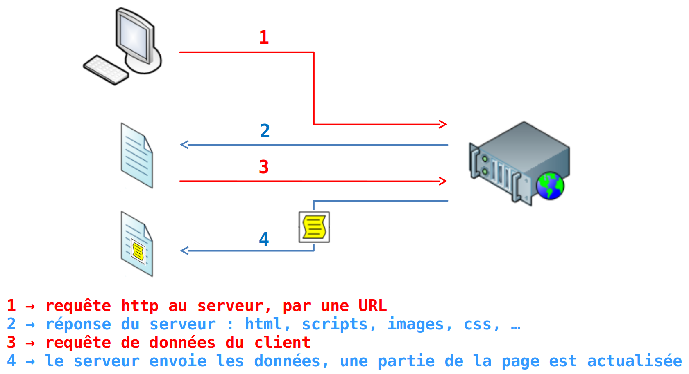{: .slide_image}

</section>
<section>

##  Utilisation plus dynamique

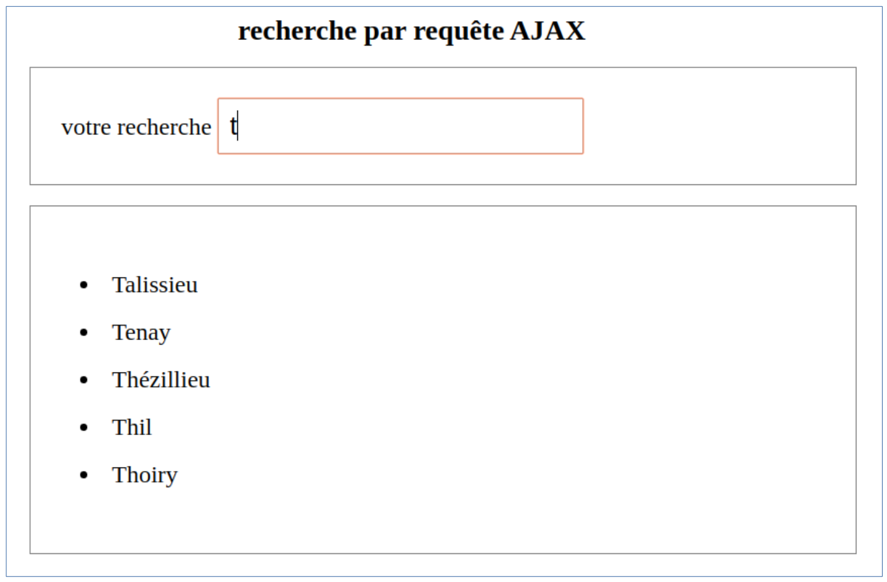{: .slide_image}

</section>
<section>

##  Exemples d'utilisation de *AJAX*

<br>
<br>

1. Autocomplétion des [recherches Google](https://www.google.fr/)
   
2. Zoom sur les [cartes OpenStreetMap](https://www.openstreetmap.org/)
   
3. Défilement infini dans un [fil Twitter](https://twitter.com/Javascript)

</section>
<section>

##  Avantages

**Avantages de l'utilisation dynamique**

**Ciblage :** 
* Affecter seulement une partie de la page, sans avoir
tout à reconstruire 
* Exemple : la `<div>` qui accueille les noms de ville

**Asynchronisme :** on dissocie les tâches.

-   On lance la requête de données  
    Exemple : au changement de l’input de recherche
-   Entre le lancement de la requête et la réception complète des
    données, le reste du script n’est pas arrêté et continue de
    s’exécuter.
-   Quand les données sont toutes arrivées, on lance le traitement prévu
    de ces données (ex : remplissage de la div).  
    Une fonction appelée fonction callback s’en charge.

</section>
<section>

##  Technologies utilisées

-   `JavaScript` pour l’objet qui gérera la requête au serveur (objet
    XMLHttpRequest) ;

-   `PHP` côté serveur pour communiquer avec la base de données (mais ce
    peut être un autre langage côté serveur).

-   `JSON` comme support de communication (format de données) pour
    transmettre les données à JavaScript.  
    `JSON` = JavaScript Object Notation.

-   L’ensemble de ces technologies est regroupé sous le nom `AJAX`   
    `AJAX` = Asynchronous JavaScript And XML  
    (car le format de données XML était plus utilisé avant)

</section>
<section>

##  Technologies utilisées

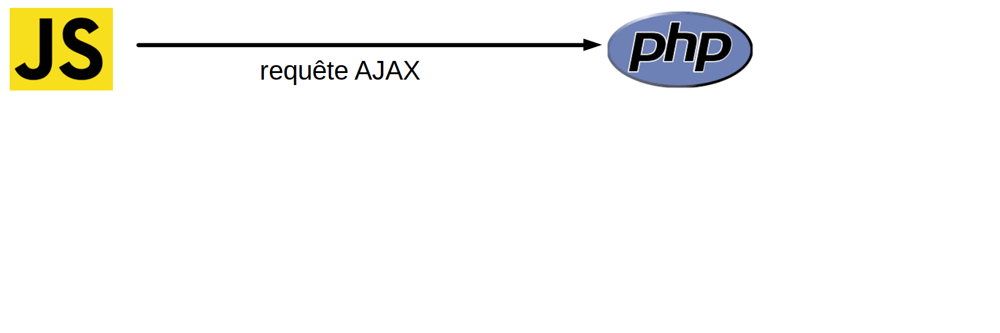{: .slide_image}

</section>
<section>

##  Technologies utilisées

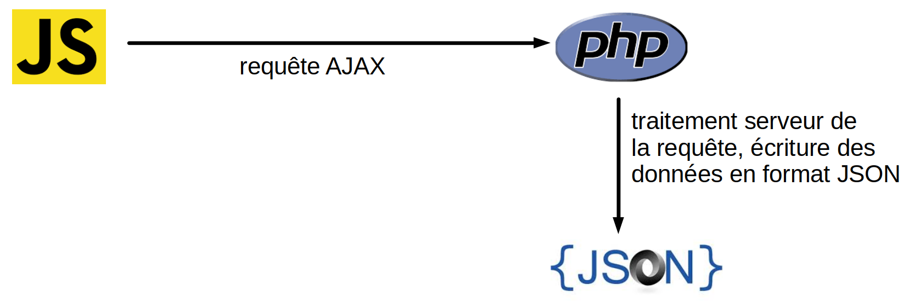{: .slide_image}


</section>
<section>

##  Technologies utilisées

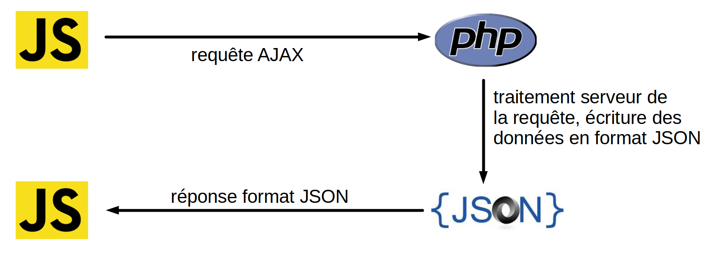{: .slide_image}

</section>
<section>

##  Technologies utilisées

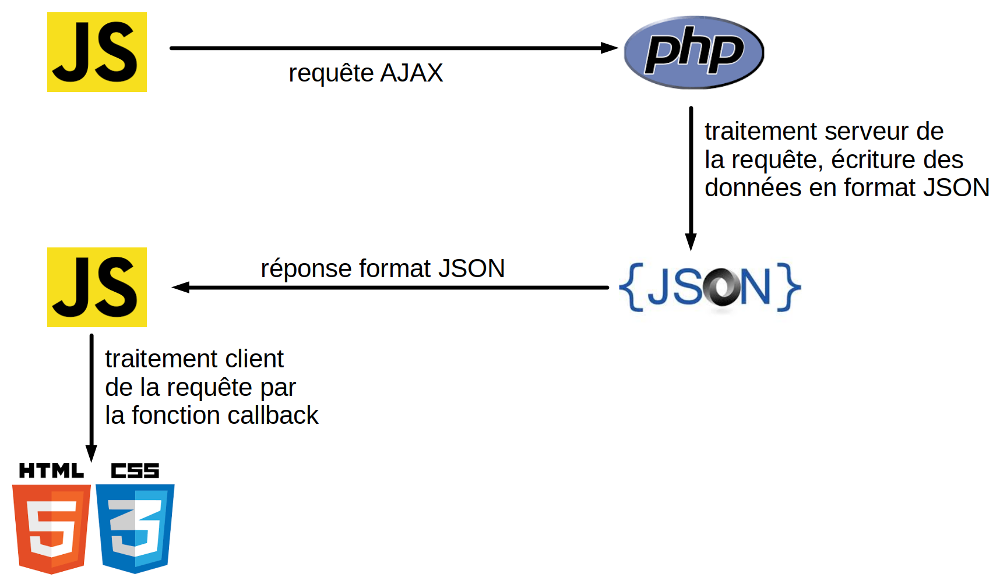{: .slide_image}

</section>
<section>

##  Format JSON

**Exemple d'un fichier de données au format JSON** 

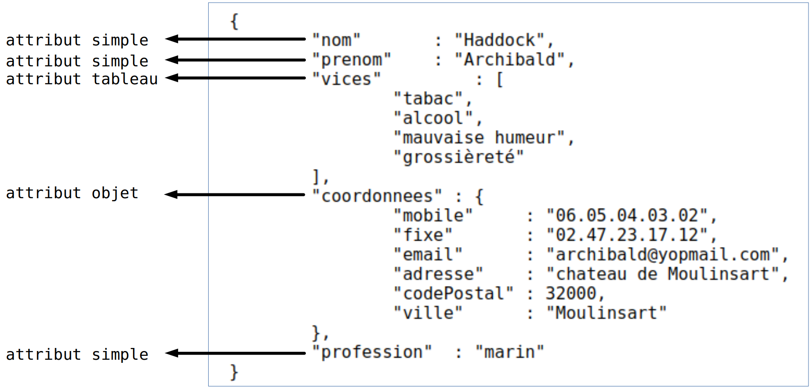{: .slide_image}

</section>
<section>

##  Traduction JavaScript → JSON

<div style="font-size:large">

```js
class Point {
   constructor (x,y,couleur,marqueur) {
      this.x = x;
      this.y = y;
      this.couleur = couleur;
      this.marqueur = marqueur;
   }
}
let A = new Point(5,-3,"rouge","croix");
console.log(A);
// → Point { x:5, y:-3, couleur:'rouge', marqueur:'croix' }

JSON.stringify(A);
// → '{"x":5,"y":-3,"couleur":"rouge","marqueur":"croix"}'
```

</div>

</section>
<section>

##  Traduction JSON → JavaScript

<div style="font-size:large">

```js
let text = '{"x":2,"y":5,"couleur":"jaune","marqueur":"rond"}'
let point = JSON.parse(text)
console.log(point);
// Affichage de la sortie DevTools
// → Object { x:2, y:5, couleur:'jaune', marqueur:'rond' }
```

<br>
<br>

**Remarque :** PHP sait aussi lire et écrire le JSON
<!-- Comment envoyer l'info à partir du serveur Web, en PHP par exemple : -->

```php
json_encode($var_php);
json_decode($json_string);
```


Donc JSON permet à PHP et JS de communiquer !

</div>


</section>

<!-- 
<section>

## Format d'échange

Donc `XMLHttpRequest` permet de lancer une communication avec le serveur à tout
moment.

**Quelles informations échanger entre le serveur et le client ?**

Naturellement, des pages Web. Mais pas que !

Si je veux que le serveur m'échange des informations plus simples (nombres,
tableaux, chaînes de caractères), il me faut une langue commune au serveur et au
JavaScript (client) :

1. Historiquement, le format XML (mais très proche du HTML)

1. Plus récemment, le format JSON

</section> 
<section>

## Informations échangées au format XML

Exemple d'un fichier *fruits.xml* :

<div style="font-size:80%">
```xml
<fruits >
    <fruit name="banana" color="yellow"/>
    <fruit name="lemon" color="yellow"/>
    <fruit name="cherry" color="red"/>
</fruits>
```

</div>

Récupération de l'information auprès du serveur :

<div style="font-size:80%">
```js
let req = new XMLHttpRequest();
req.open("GET", "../assets/fruit.xml", false);
req.send(null);
req.responseXML.querySelectorAll("fruit").length;
// → 3
```

</div>

L'objet *req.responseXML* contient le document structuré
(un peu comme le DOM).

</section> 

<section>

## Le format JSON

**Qu'est-ce que JSON ?**

**JSON** signifie *JavaScript Object Notation*. C'est un format d'échange de
données (nombres, tableaux, objets ...) qui reprend la syntaxe du JavaScript.

**Exemple :**

<div style="font-size:80%">
```js
JSON.parse('{"banana":"yellow","lemon":"yellow","cherry":"red"}');
// transforme le texte précédent en l'objet JavaScript
// {banana: "yellow", lemon: "yellow", cherry: "red"}
```

</div>

<br>

**Remarque :** PHP sait aussi lire et écrire le JSON

```php
echo JSON_encode($var_php);
```


Donc JSON permet à PHP et JS de communiquer !


</section>
<section>

## Informations échangées au format JSON

Exemple d'un fichier *fruits.json* :

```json
{"banana":"yellow","lemon":"yellow","cherry":"red"}
```


<br>

Récupération de l'information auprès du serveur :

<div style="font-size:80%">
```js
let req = new XMLHttpRequest();
req.open("GET", "../assets/fruit.json", false); 
req.send(null); 
console.log(JSON.parse(req.responseText));
// → {banana: "yellow", lemon: "yellow", cherry: "red"}
```

</div>

</section>
<section>

## Et AJAX ?

Acronyme de **Asynchronous JavaScript and XML**

C'est globalement ce qu'on vient de voir :

- DOM et JavaScript permettent de modifier l'information présentée dans le navigateur "incrémentalement",
en modifiant un sous-arbre seulement ;

- L'objet XHR sert au dialogue asynchrone avec le serveur Web ;

- XML (ou JSON ou ...) structure les informations transmises entre le serveur Web et le navigateur.

</section>
-->
<section>

##  L’interface `XMLHttpRequest`

*  Un objet implémentant cette interface JavaScript pourra matérialiser la
   communication entre le client et le serveur pour le lancement de la requête
   au serveur ;
*  Il peut établir une communication synchrone ou asynchrone avec le
   serveur. Une communication en mode asynchrone n’est pas bloquante.
*  Il est instancié ainsi :
   ```js
   let xhr = new XMLHttpRequest();
   ```
*  Il dispose de méthodes pour ouvrir une requête, l’envoyer,
   l’abandonner, connaître l’évolution de son statut, connaître le
   contenu de la réponse.

</section>
<section>

##  Méthodes de `XMLHttpRequest`

1. la méthode `open` (ouvre la requête)

   ```js
   xhr.open("GET", "http://www.google.fr", true);
   ```

   Le 3ème argument indique si la requête est asynchrone

2. la méthode `send` (envoie la requête avec un corps de requête)

   ```js
   xhr.send(contenu)
   ```

   -  si la méthode est `GET`, contenu est `null`;
   -  si la méthode est `POST`, contenu est 
      -   soit `null` 
      -   soit égal à une chaîne du type  
        `param1=valeur1&param2=valeur2&…`

<!-- Voir notes : est-ce toujours vrai ? -->

</section>
<section>

## Bref rappel sur *HTTP*

Demander une page Web, c'est envoyer une requête HTTP à un serveur HTTP :

```HTTP
GET /~rletud/index.html HTTP/1.1
Host: webinfo.iutmontp.univ-montp2.fr

```


Le serveur renvoie alors sa réponse HTTP, qui contient la page Web demandée dans
son *corps* :

```HTTP
HTTP/1.1 200 OK
Content-Length: 65585
Content-Type: text/html
Last-Modified: Wed, 09 Apr 2014 10:48:09 GMT

<!doctype html>
<html>...
```


<!-- Quand on saisit une URL sur un navigateur, une requête HTTP est envoyée au -->
<!-- serveur pour renvoyer au client une page Web. Techniquement, si on se souvient -->
<!-- des cours de réseaux de l'an dernier : -->

<!--  - Un message TCP  est envoyé du client au serveur (domaine) sur le port 80.   -->
<!-- Le message contient des lignes du genre : -->

<!--  - Un message TCP est renvoyé du serveur vers le client. -->

<!--    ``` -->
<!--    HTTP/1.1 200 OK -->
<!--    Content-Length: 65585 -->
<!--    Content-Type: text/html -->
<!--    Last-Modified: Wed, 09 Apr 2014 10:48:09 GMT -->
<!--    <!doctype html> -->
<!--    ... -->
<!--    ``` -->
<!--    {:.http} -->

</section>
<section>
## Remarques

*Requête :*

- la *méthode* de la requête (GET, POST, DELETE, PUT)
  <!-- GET : requête sans effet de bord sur le serveur -->
  <!-- POST : requête pouvant modifier le serveur -->
- le chemin de la ressource
- la version du protocole HTTP
- le *Host*, càd le serveur HTTP

*Réponse :*

- la version du protocole HTTP
- l'état (*status*) de la réponse sous forme numérique et texte  (erreur si &ge; 400) :
  - 200 OK
  - 304 Not Modified
  - 404 Not Found
  - 500 Internal Server Error
</section>
<section>

## Requêtes POST

Les requêtes HTTP de type POST possèdent un **corps de requête** en plus de
l'en-tête.

Le corps de la requête **HTTP** sert ici à envoyer les informations.

```HTTP
POST /~rletud/traitePost.php HTTP/1.1
Host: localhost
Content-Length:14
Content-Type:application/x-www-form-urlencoded

prenom=Marc&nom=Assin

```

</section>
<section>

## Attributs de `XMLHttpRequest`

3. l’attribut `readyState`

   -  Il indique l’état de réception des données :

   -  `readyState = 0` : objet créé mais pas ouvert (avant `open`)
   -  `readyState = 1` : après `open`, mais avant `send`
   -  `readyState = 2` : après `send`, avant réception de données
   -  `readyState = 3` : données en cours de réception
   -  `readyState = 4` : données entièrement reçues


3. l’attribut `responseText`

   Il contient, sous forme d’une chaîne de caractères, les données en
   réponse à la requête. Il n’est complet que si `readyState` est à la valeur
   4.

</section>
<section>

## Requête synchrone avec `XHR` 

Il suffit de :

- créer une instance de la classe `XMLHttpRequest`
- initialiser la requête et écriture son en-tête avec `open`
- écrire le corps de la requête et l'envoyer avec `send`

Après `send`, la réponse HTTP (le *status*, le document ...) est écrit dans ce
même objet.

<div style="font-size:80%">

```javascript
let req = new XMLHttpRequest();
req.open('GET', 'http://romainlebreton.github.io/', false); 
req.send(null); // null: corps de la requête vide si GET

console.log(req.status); // -> 200
console.log(req.responseText.substring(0,100)); // -> page Web retournée
```
</div>
<!-- let req = new XMLHttpRequest(); -->
<!-- req.open('GET', 'http://romainlebreton.github.io/', false);  -->
<!-- req.send(null); // null: corps de la requête vide si GET -->

<!-- console.log(req.status, req.statusText); // -> 200 OK -->
<!-- console.log(req.getResponseHeader("content-type")); //->text/html -->
<!-- if (req.status == 200) -->
<!--    console.log(req.responseText); // -> page Web retournée -->

<!-- **Remarque :** pas terrible d'un point de vue du génie logiciel de récupérer le -->
<!--   résultat dans le même objet ! -->

<!--
Faire la démo mais attention :

XHR ne permet que de faire des requêtes sur le même domaine pour des questions
de sécurité

-->

</section>
<section>

## Défaut d'une requête synchrone

<!-- C'est le `false` en dernier argument de la méthode `open` de l'objet XHR qui indique que la requête n'est *pas* asynchrone  -->
<!-- et est donc synchrone.  -->

Inconvénients d'une requête synchrone :

- **Le `send` est bloquant**, c'est-à-dire que le JavaScript reste bloqué sur
`send` tant que l'on a pas reçu la réponse du serveur.

- C'est d'autant plus gênant que la connexion est mauvaise, le serveur est lent
  ou le fichier renvoyé est gros !

<div class="myfootnote">
**Remarque :** C'est le `false` de `req.open('GET', url, false)` qui fait que la
  requête est synchrone.
</div>

</section>
<section>

## Défaut d'une requête synchrone

<br>

[Exemple de blocage avec une requête synchrone](https://webinfo.iutmontp.univ-montp2.fr/~lebreton/ExempleBlocageAJAX/)

Les événements ne se déclenchent pas sur le navigateur ! **Pourquoi ??**

<br>

<div style="font-size:80%">
```js
url = "cityRequest.php?name=Vi";
let httpRequest = new XMLHttpRequest();
// false désactive l'asynchronisme
httpRequest.open("GET", url, false);
httpRequest.send(null);
console.log(httpRequest.response);
```


<!-- ``` -->
<!-- function myajax(url, callBack) { -->
<!--     let httpRequest = new XMLHttpRequest(); -->
<!--     // false désactive l'asynchronisme -->
<!--     httpRequest.open("GET", url, false); -->
<!--     httpRequest.send(null); -->
<!--     callBack(httpRequest); -->
<!-- } -->
<!-- ``` -->
<!-- {:.javascript} -->

</div>

</section>
<section>

## Requête `a`synchrone avec `XHR`

On active l'`a`synchronisme avec `req.open('GET', url, true)`

<br>
<br>

**Piège :**

<div style="font-size:80%">
```js
let req = new XMLHttpRequest(); 
req.open ("GET", "http://romainlebreton.github.io", true); 
req.send(null);
console.log("Réponse :" + req.responseText); 
// Réponse vide !
```
</div>

</section>
<section>

## Requête `a`synchrone avec `XHR`

On active l'`a`synchronisme avec `req.open('GET', url, true)`

<br>

**Solution :**
Il faut un mécanisme pour notifier au client que la requête est terminée :

<div class="centered">
Écoute de l'événement `"load"`
</div>

<br>

**Exemple :**
<div style="font-size:80%">
```js
let req = new XMLHttpRequest(); 
req.open ("GET", "http://romainlebreton.github.io", true); 
req.addEventListener("load", 
  function() { 
    console.log ("Réponse :" + req.responseText.substring(0,100)); 
  }
);
req.send(null);
```
</div>

</section>
<section>

## Boucle des évènements

Même les événements ne se déclenchent pas sur le navigateur ! **Pourquoi ??**

**Piège (version alternative) :**

<div style="font-size:80%">
```js
console.log("Étape 1.");
setTimeout(function etape2 () { console.log("Étape 2.");}, 0);
console.log("Étape 3.");
```
</div>

<br>

<div class="incremental">
<div>

**Parce que les événements en JavaScript ne sont déclenchés que lorsque la pile des appels de fonctions est vide !**

[Visualisation de la queue des événements avec l'outil Loupe](http://latentflip.com/loupe/?code=Y29uc29sZS5sb2coIsl0YXBlIDEuIik7CnNldFRpbWVvdXQoZnVuY3Rpb24gZXRhcGUyICgpIHsgCiAgICBjb25zb2xlLmxvZygiyXRhcGUgMi4iKTt9LAogICAgMCk7CmNvbnNvbGUubG9nKCLJdGFwZSAzLiIpOw%3D%3D!!!PGJ1dHRvbj5DbGljayBtZSE8L2J1dHRvbj4%3D)

</div>
</div>

<!--
Ancien lien :
(http://latentflip.com/loupe/?code=JC5vbignYnV0dG9uJywgJ2NsaWNrJywgZnVuY3Rpb24gb25DbGljaygpIHsKICAgIHNldFRpbWVvdXQoZnVuY3Rpb24gdGltZXIoKSB7CiAgICAgICAgY29uc29sZS5sb2coJ1lvdSBjbGlja2VkIHRoZSBidXR0b24hJyk7ICAgIAogICAgfSwgMjAwMCk7Cn0pOwoKY29uc29sZS5sb2coIkhpISIpOwoKc2V0VGltZW91dChmdW5jdGlvbiB0aW1lb3V0KCkgewogICAgY29uc29sZS5sb2coIkNsaWNrIHRoZSBidXR0b24hIik7Cn0sIDUwMDApOwoKY29uc29sZS5sb2coIldlbGNvbWUgdG8gbG91cGUuIik7!!!PGJ1dHRvbj5DbGljayBtZSE8L2J1dHRvbj4%3D)

Autre demo :
function a() { b(); }
function b() { c(); }
function c() { d(); }
function d() { console.log('hi'); }
document.body.addEventListener('click',
  function () {
    setTimeout(function () {
    a();
  }, 1000);
});

-->

</section>
<section>

## Un dernier exemple montrant la différence entre appels synchrones et asynchrones

[3 boutons pour 3 comportements différents](https://webinfo.iutmontp.univ-montp2.fr/~lebreton/JavaScriptAsynchrone/)

<!-- 
Montrer le panneau network et le code source
Typo : arrivé -> arrivée
-->

</section>
<section>

## Sources

* [Eloquent javascript](http://fr.eloquentjavascript.net)
* [Outil Loupe par Philip Roberts](http://latentflip.com/loupe/?code=JC5vbignYnV0dG9uJywgJ2NsaWNrJywgZnVuY3Rpb24gb25DbGljaygpIHsKICAgIHNldFRpbWVvdXQoZnVuY3Rpb24gdGltZXIoKSB7CiAgICAgICAgY29uc29sZS5sb2coJ1lvdSBjbGlja2VkIHRoZSBidXR0b24hJyk7ICAgIAogICAgfSwgMjAwMCk7Cn0pOwoKY29uc29sZS5sb2coIkhpISIpOwoKc2V0VGltZW91dChmdW5jdGlvbiB0aW1lb3V0KCkgewogICAgY29uc29sZS5sb2coIkNsaWNrIHRoZSBidXR0b24hIik7Cn0sIDUwMDApOwoKY29uc29sZS5sb2coIldlbGNvbWUgdG8gbG91cGUuIik7!!!PGJ1dHRvbj5DbGljayBtZSE8L2J1dHRvbj4%3D)

</section>
<!--
<script>
// document.addEventListener("load",function() {Dz.play(); });
setTimeout(function () {Dz.play();}, 1500);
</script>
-->

<!--
Action de JavaScript pour réafficher la page 

Regarder aussi requestAnimationFrame (et repaint (loupe)), preventDefault, load event, debouncing (en td - 2 façons) et autres trucs exotiques

Sources :
Eloquent JavaScript (et pour les images)
You don't know JavaScript
Loupe (latentflip)
Stackoverflow pour chargement page (meilleure rèf ?)
-->

